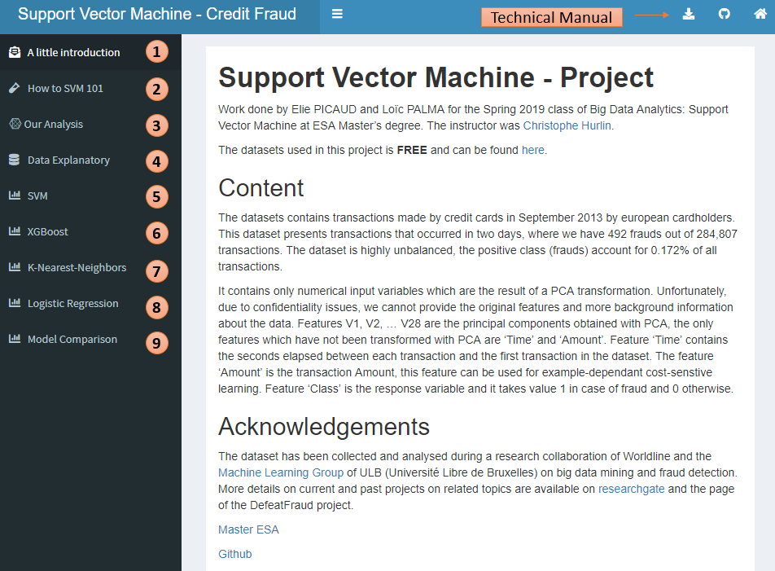

```{r setup, include=FALSE}
knitr::opts_chunk$set(echo = TRUE)
```

## Technical Documentation

Welcome to the Technical Manual of the Support Vector Machine Dashboard.  
If you are there, that is most likely because you have clicked the download button in the top-right hand corner of the dashboard's header.  

The objective of this application is to propose to the customer a site allowing to understand
the implementation of the SVM and to visualize online the performances of this solution by having the possibility to choose certain hyper-parameters or methods of selecting these hyper-parameters.  

If you want to get in touch with R Shiny or you just want to know more about it, please have a look at the following \href{https://shiny.rstudio.com/}{link}.  
If you want to know more about Support Vector Machine without going further into the maths behind it, we strongly recommend \href{http://web.mit.edu/6.034/wwwbob/svm-notes-long-08.pdf}{An Idiot’s guide to Support Vector Machines (SVMs)} from R. Berwick\footnote{Professor, Computational Linguistics, MIT.}.  
If you want a more in-depth introduction to Support Vector Machine, consider reading  \href{https://sites.google.com/view/christophe-hurlin/teaching-resources/support-vector-machine}{Support Vector Machine} by C. Hurlin\footnote{Professor, Economics, University of Orleans.}.
\newline  

Here is an overview of what the dashboard (should) look like:

<center>

</center>


Basically, there is 9 tabs in our application:
\begin{enumerate}
\item \textbf{"A little Introduction"} : Here you can find information about the authors as well as where to find the datasets in case you want to try it.
\item \textbf{"How to SVM 101"} : Here is a little introduction about Support Vector Machine, explaining briefly what is a SVM, the different types of SVM, the different types of kernel, what is the "kernel trick" as well as the different kernels that exists.
\item \textbf{"Our Analysis"} : Here is what we have done on our side. We explained the basics (recall, precision, confusion matrix, ROC and so on).  We tried to fit the best models for each algorithms that we implemented, showing the results and briefly conclude with a model comparison. We also discuss the limits of doing Random Under Sampling on our datasets by doing a comparison with algorithms that are being trained on the whole training set. \textbf{If you have troubleshootings rendering \LaTeX  formulas, please check your navigator's cache.}
\item \textbf{"Data Explanatory"} : Here you can play around with the data. The first box is meant to show a few observations with all the variables so you can have a look at what the variables looks like. Then on the other boxes, you can have some simple and basics informations about a variable. At the end, you get the correlation matrix between all the variables.
\item \textbf{"SVM"} : Here is the first tab where you can fit a model to our training set. For instance, you can fit a SVM model by choosing all the parameters and hyperparameters that are explained in the "How to SVM 101" tab.
\item \textbf{"XGBoost"} : Here you can fit a XGBoost model. If you want more details about XGBoost please follow this \href{https://xgboost.readthedocs.io/en/latest/tutorials/model.html}{link}. It is worth mentionning that XGBoost is widely used and is a really popular tool among Kaggle competitors and Data Scientists in industry. More details about the parameters/hyperparameters can be found \href{https://cran.r-project.org/web/packages/xgboost/xgboost.pdf}{here}.
\item \textbf{"K-Nearest-Neighbors"} : Here you can fit a KNN model. If you want more details about what KNN is, please have a look at this \href{https://en.wikipedia.org/wiki/K-nearest_neighbors_algorithm}{link}.
\item \textbf{"Logistic Regression"} : Here you can fit a Logistic Regression. Feel free to choose the variables you want the logit to take consideration of. Please be aware that you basically need to \textbf{always} have the target variable (Class) selected. More information about the Logistic Regression \href{https://en.wikipedia.org/wiki/Logistic_regression}{here}.
\item \textbf{"Model Comparison"} : Here you have the summary of all the ROCs and PROCs of the models you have trained. Please be aware that in order this tab to work, you need to have trained all 4 type of models (SVM, XGBoost, KNN and Logistic Regression).
\end{enumerate}  

&nbsp;  
&nbsp;  
&nbsp;  

<center>

</center>

Apart from the download button, you can find a link to our \href{https://github.com/loicpalma/Shiny_App}{GitHub repository} by clicking on the GitHub icon in the top-right hand corner of the dashboard's header.  
You will also find a home button. This one will bring you back to the introduction tab.
\newline

&nbsp;  
&nbsp;  
&nbsp; 
&nbsp;  
 
 
\textbf{NOTA BENE} : We are using a free version of Shinyapps.io. That is to say the application might be sensible and could \textbf{crash}. This comes from the fact that we are
loading huge datasets as well as fitting huge memory-demanding models. We are aware of this issue and would like to apologize.